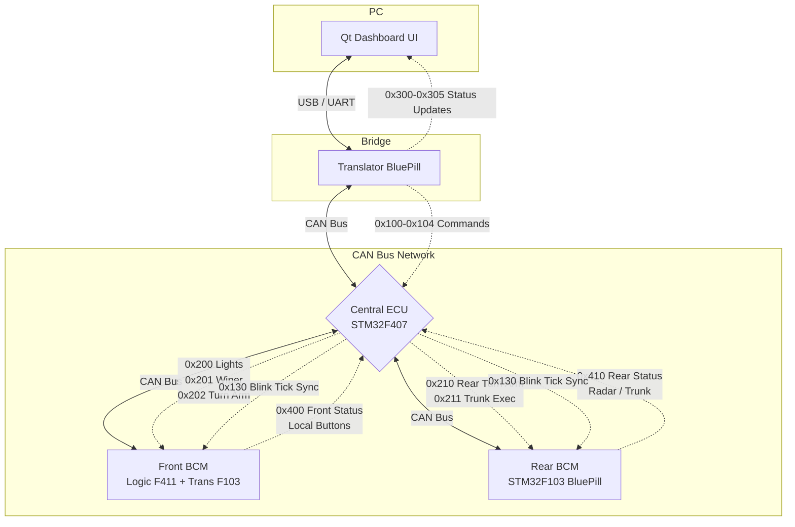

  <h3>TẬP ĐOÀN FPT — VIỆN ĐÀO TẠO QUỐC TẾ FPT TP.HCM (FAI)</h3>
  
<strong>Chương trình:</strong> Kỹ Sư Hệ Thống Nhúng Ô Tô (Automotive Embedded Systems)

  
<strong>Lớp:</strong> M1.2510.E0 | <strong>Nhóm:</strong> 2 | <strong>Thời gian:</strong> Tháng 09/2026

  
<strong>Supervisor:</strong> Phạm Toàn Văn Võ <em>Senior Automotive/Embedded Software Engineer tại HELLA (Cựu FPT Software)</em>

---

## 👥 Đội ngũ phát triển (Nhóm 2)
| Tên | MSSV | Vai trò |
|-----|------|---------|
| **Trịnh Đăng Khoa** | SE203770 | Trưởng nhóm & System Architect |
| **Nguyễn Đăng Cao Huy** | FMS00041 | Kỹ sư Rear BCM |
| **Nguyễn Quốc Đạt** | FMS00045 | Kỹ sư Front BCM |
| **Lê Công Tiểu Long** | FMS00049 | Kỹ sư Gateway & Đo kiểm |
| **Nguyễn Phương Duy Thắng** | FMS00038 | Kỹ sư HMI Qt 6 / QML |

---

> [!TIP]
> 📖 **Interactive Project Guide & Pinout Reference:** Open [`project_guide.html`](./project_guide.html) in your browser for complete interactive pinouts, wiring schematics, CAN v3.0 protocol tables, and one-click IDE import instructions.
>
> 🖥️ **Live CAN v3.0 Bus Monitor & Injector:** Run `python front_bcm_firmware/can_monitor.py COM9` to inspect and decode 100% of live CAN v3.0 traffic with zero spam and instant command injection (keys: `1`, `2`, `0`, `h`, `w`, `t`, `clear`).

# Smart Vehicle Dashboard Cluster

This repository contains the complete firmware and software for a distributed, CAN-bus-based Smart Vehicle Dashboard Cluster simulator. It demonstrates a multi-MCU automotive architecture using the **CAN Bus v3.0 Protocol**.

## Repository Structure

1. **`qt_dashboard/`** - PC UI Dashboard (C++ / Qt6 / QML). Connects to the bus via USB (UART).
2. **`translator_firmware/`** - CAN to UART Bridge (STM32F103C8T6). Sniffs CAN frames and injects Qt commands.
3. **`front_bcm_firmware/`** - Front Actuators & Lights (Dual-board: STM32F411 Logic + STM32F103 CAN Bridge).
4. **`rear_bcm_firmware/`** - Rear Actuators, Trunk Servo, Ultrasonic Radar, and Tail/Brake LEDs (STM32F103C8T6).
5. **`main_mcu_firmware/`** - Central Sensor ECU & Error Aggregator (STM32F407VGT6 Discovery OR BluePill).
6. **`can_messages_shared/`** - Shared CAN ID definitions, DLCs, and bitmasks used by all C/C++ projects.

---

## System Architecture & Data Flow

The system operates on a **Centralized Command Architecture**. The Central ECU is the brain of the network. The Front and Rear BCMs (Body Control Modules) execute commands sent by the Central ECU and report local button/sensor events.

### Architecture Flowchart

---

## Protocol Overview (CAN v3.0)

Messages are strictly divided into priority groups to prevent bus collisions:

*   **GROUP A (`0x100 - 0x10F`)**: UI Commands (Qt -> Central ECU). E.g., User presses headlight button on GUI.
*   **GROUP B (`0x200 - 0x21F`)**: Execution Commands (Central ECU -> BCMs). The Central ECU tells BCMs what physical pins to turn on.
*   **GROUP C (`0x300 - 0x30F`)**: Status Updates (Central ECU -> Qt). Real-time gauge data (Speed, Fuel, Gear).
*   **GROUP D (`0x400 - 0x41F`)**: BCM Reports (BCMs -> Central ECU). BCMs report physical button presses and sensor data (e.g., Radar distance).
*   **GROUP E/F (`0x500 - 0x61F`)**: Diagnostics & Faults.
*   **GROUP G (`0x700 - 0x720`)**: Heartbeats. Every node broadcasts a 1Hz heartbeat. If a heartbeat drops, the Central ECU flags a node fault.

---

## Turn Signal & Hazard Multi-Node Synchronization

To ensure authentic automotive behavior across distributed nodes, turn signals and hazard warning flashers are synchronized between **Front BCM (STM32F411)**, **Rear BCM (STM32F103)**, and the **Qt 6 HMI Dashboard** using a master phase tick:

1. **Driver Input:** Turn signal stalks or buttons can be pressed on Front BCM (`PB0`/`PB1`/`PB2`) or commanded from the Qt Dashboard / CAN injector (`0x102`).
2. **Central Arbitration:** Central ECU (`STM32F407`) receives the request, evaluates safety priorities (Hazard overrides individual turn signals), and arms the nodes via `CAN_ID_EXEC_FRONT_TURN` (`0x202`) and `CAN_ID_EXEC_REAR_TURN` (`0x210`).
3. **Master Sync Pulse:** Central ECU broadcasts `CAN_ID_BLINK_TICK` (`0x130`) every 500ms.
4. **Lockstep Execution:**
   - **Front BCM:** F103 receives `0x130` and forwards the pulse to F411 to toggle `PC4` (Left) and `PC5` (Right) LEDs.
   - **Rear BCM:** Toggles `PB1` (Left) and `PB3` (Right) LEDs.
   - **Qt Dashboard:** Receives `CAN_ID_STATUS_TURN_BLINK` (`0x302`) to toggle the cluster arrow indicators simultaneously.
   - **Result:** 100% phase-aligned blinking across all physical LEDs and digital gauges without drift.
