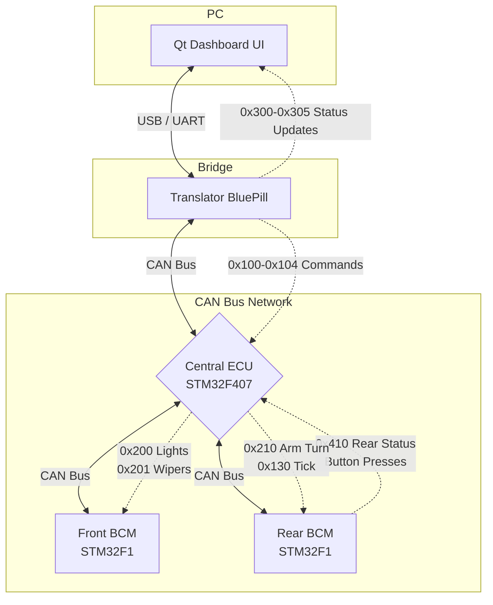



  <h3>TẬP ĐOÀN FPT — VIỆN ĐÀO TẠO QUỐC TẾ FPT TP.HCM (FAI)</h3>
  
<strong>Chương trình:</strong> Kỹ Sư Hệ Thống Nhúng Ô Tô (Automotive Embedded Systems)

  
<strong>Lớp:</strong> M1.2510.E0 | <strong>Nhóm:</strong> 2 | <strong>Thời gian:</strong> Tháng 09/2026

  
<strong>Supervisor:</strong> Phạm Toàn Văn Võ <em>Senior Automotive/Embedded Software Engineer tại HELLA (Cựu FPT Software)</em>

---

## 👥 Đội ngũ phát triển (Nhóm 2)
| Tên | MSSV | Vai trò |
|-----|------|---------|
| **Trịnh Đăng Khoa** | SE203770 | Trưởng nhóm & System Architect |
| **Nguyễn Đăng Cao Huy** | FMS00041 | Kỹ sư Rear BCM |
| **Nguyễn Quốc Đạt** | FMS00045 | Kỹ sư Front BCM |
| **Lê Công Tiểu Long** | FMS00049 | Kỹ sư Gateway & Đo kiểm |
| **Nguyễn Phương Duy Thắng** | FMS00038 | Kỹ sư HMI Qt 6 / QML |

---
# Smart Vehicle Dashboard Cluster

This repository contains the complete firmware and software for a distributed, CAN-bus-based Smart Vehicle Dashboard Cluster simulator. It demonstrates a multi-MCU automotive architecture using the **CAN Bus v3.0 Protocol**.

## Repository Structure

1. **`qt_dashboard/`** - PC UI Dashboard (C++ / Qt6 / QML). Connects to the bus via USB (UART).
2. **`translator_firmware/`** - CAN to UART Bridge (STM32F103C8T6). Sniffs CAN frames and injects Qt commands.
3. **`front_bcm_firmware/`** - Front Actuators & Lights (STM32F103C8T6).
4. **`rear_bcm_firmware/`** - Rear Actuators, Trunk Servo, and Turn Signal Controller (STM32F103C8T6).
5. **`main_mcu_firmware/`** - Central Sensor ECU & Error Aggregator (STM32F407VGT6 Discovery OR BluePill).
6. **`can_messages_shared/`** - Shared CAN ID definitions, DLCs, and bitmasks used by all C/C++ projects.

---

## System Architecture & Data Flow

The system operates on a **Centralized Command Architecture**. The Central ECU is the brain of the network. The Front and Rear BCMs (Body Control Modules) act as "dumb actuators" that simply report button presses and execute commands sent by the Central ECU.

### Architecture Flowchart

---

## Protocol Overview (CAN v3.0)

Messages are strictly divided into priority groups to prevent bus collisions:

*   **GROUP A (`0x100 - 0x10F`)**: UI Commands (Qt -> Central ECU). E.g., User presses headlight button on GUI.
*   **GROUP B (`0x200 - 0x21F`)**: Execution Commands (Central ECU -> BCMs). The Central ECU tells BCMs what physical pins to turn on.
*   **GROUP C (`0x300 - 0x30F`)**: Status Updates (Central ECU -> Qt). Real-time gauge data (Speed, Fuel, Gear).
*   **GROUP D (`0x400 - 0x41F`)**: BCM Reports (BCMs -> Central ECU). BCMs report physical button presses and sensor data (e.g., Radar distance).
*   **GROUP E/F (`0x500 - 0x61F`)**: Diagnostics & Faults.
*   **GROUP G (`0x700 - 0x720`)**: Heartbeats. Every node broadcasts a 1Hz heartbeat. If a heartbeat drops, the Central ECU flags a node fault.

---

## Hardware Pivot: Turn Signal Routing

Due to physical test-rig constraints, the physical turn signal stalks (buttons) and the LED blinkers (front and rear) are all wired to the **Rear BCM**. The logic flow for turn signals works as follows to guarantee perfect UI synchronization:

1. **Input:** The driver presses the left turn signal button physically wired to the **Rear BCM**.
2. **Report:** The Rear BCM transmits `CAN_ID_REPORT_REAR_STATUS` (`0x410`) with the `REAR_ACT_LTURN` bit set.
3. **Brain Processing:** The Central ECU receives `0x410`, registers the driver's intent, and evaluates safety overrides (e.g., Hazards).
4. **Arming:** The Central ECU transmits `CAN_ID_EXEC_REAR_TURN` (`0x210`) with `EXEC_TURN_LEFT_ARM`, telling the Rear BCM it is authorized to blink.
5. **Synchronization:** The Central ECU broadcasts the `CAN_ID_BLINK_TICK` (`0x130`) every 500ms.
6. **Execution:** Upon receiving `0x130`, the Rear BCM toggles its LEDs. Simultaneously, the Qt Dashboard receives `CAN_ID_STATUS_TURN_BLINK` (`0x302`) and toggles the UI arrow, achieving perfect 1:1 hardware/software sync.

